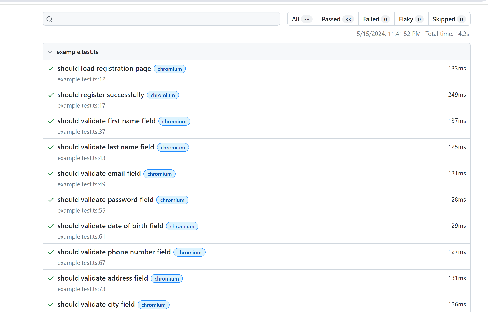

# Playwright Framework

[](https://github.com/anoopsimon/playwright-framework/blob/main/.github/workflows/playwright.yml)
[](https://opensource.org/licenses/MIT)
[](https://nodejs.org/)
[](https://playwright.dev/)

Simple JS automation test project template that features `Playwright` for ui automation

Other features
  -  Allure Single file Report
  -  GH Action Integrated for CI run
  -  Extendable to add more automation types such as REST, mobile etc.


Allure Report live [here](https://anoopsimon.github.io/playwright-framework/)



```bash
npx playwright test && npx playwright show-report
```

If there are test failures due missing browser exe please re run `npx playwright install` 

Example error to look for :
`Error: browserType.launch: Executable doesn't exist at C:\Users\xxxx\AppData\Local\ms-playwright\chromium-1140\chrome-win\chrome.exe
`


Allure report
```
npx allure generate --single-file --clean
```